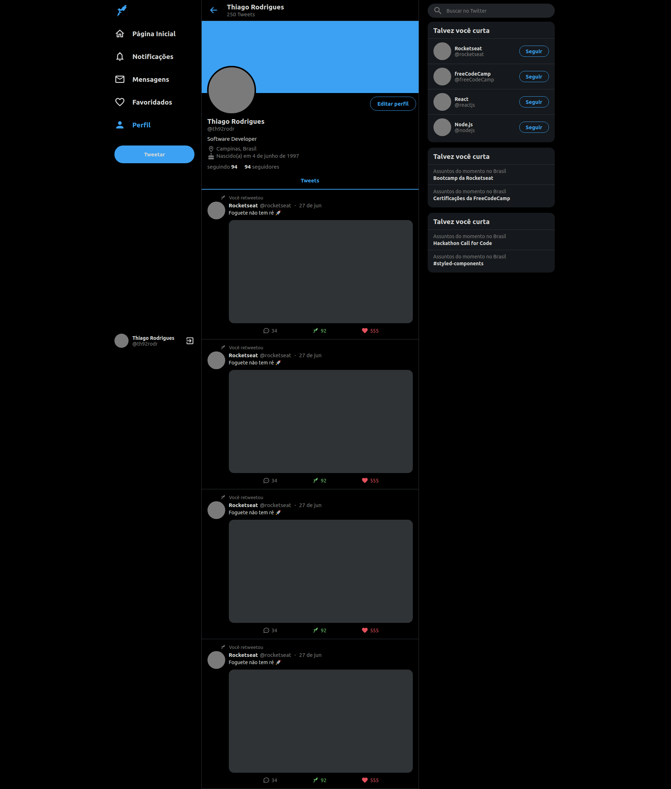
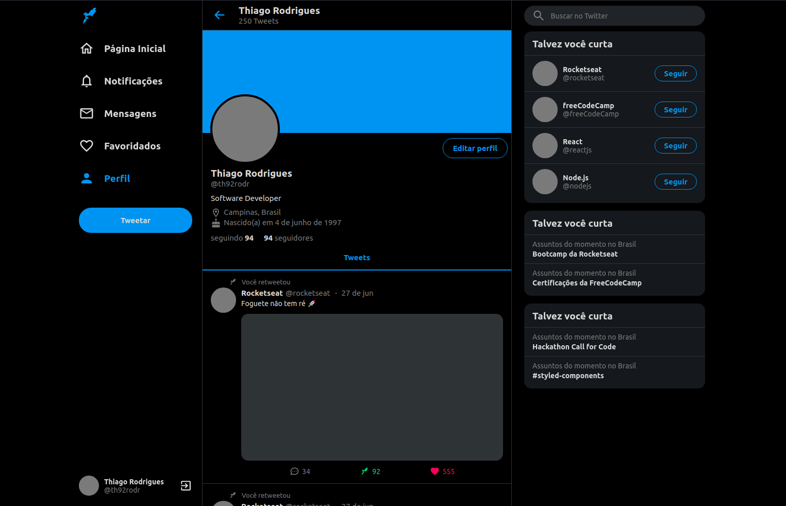
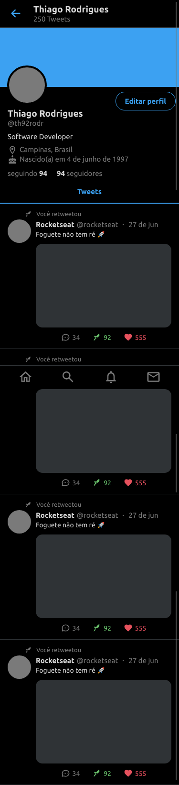
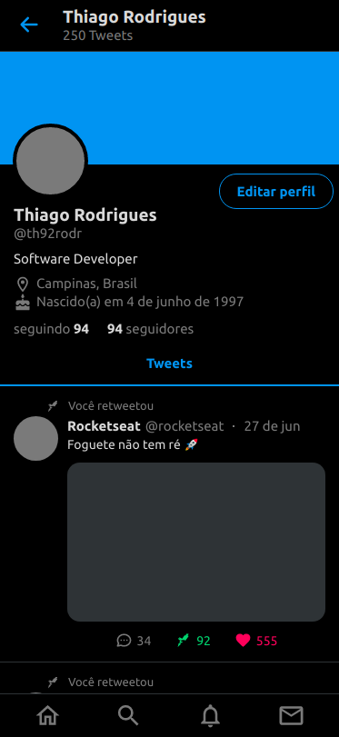

<h1 align="center">
   Twitter UI Clone
</h1>

<p align="center">A responsive UI clone of Twitter.</p>

<p align="center">
  
  
  <a href="https://github.com/th92rodr/twitter-ui-clone/commits/master">
    
  </a>
   
   <a href="https://github.com/th92rodr/twitter-ui-clone/stargazers">
    
  </a>
</p>

<p align="center">
  <a href="https://www.repostatus.org/"></a>
</p>

<p align="center">
 <a href="#about">About</a> •
 <a href="#tech-stack">Tech Stack</a> •
 <a href="#layout">Layout</a> •
 <a href="#how-it-works">How it works</a> •
 <a href="#license">License</a>
</p>

## About

A responsive UI clone of Twitter.

## Tech Stack

The following tools were used for building this project:

- [React.js](https://pt-br.reactjs.org/)
- [TypeScript](https://www.typescriptlang.org/)
- [Styled Components](https://www.styled-components.com/)

---

## Layout

<h2 align="center">
  Web
</h2>

<p align="center">
  
  
</p>

<h2 align="center">
  Mobile
</h2>

<p align="center">
  
  
</p>

---

## How it works

### Pre-requisites

Before you begin, you will need to have the following tools installed on your machine:

- `Node.js`<br />
  recommend version 12.18

  `Node` can be installed from `https://nodejs.org/en/`.

- `NPM` or `Yarn`

  - `NPM`:<br />
    recommend version 6.14

    Installing `Node` will also install `NPM` automatically.

  - `Yarn`:<br />
    recommend version 1.22<br />
    required version 1.\*

    `Yarn` can be installed from `https://classic.yarnpkg.com/en/`.

### Running the APP

- Install the project dependencies:

```sh
yarn install
# or
npm install
```

- Start the APP:

```sh
yarn start
# or
npm start
```

---

## License

This project is under the license [MIT](./LICENSE).
